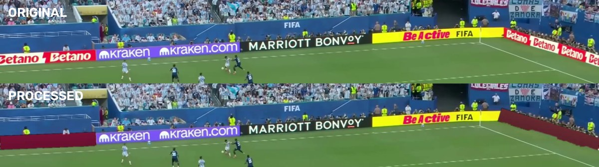
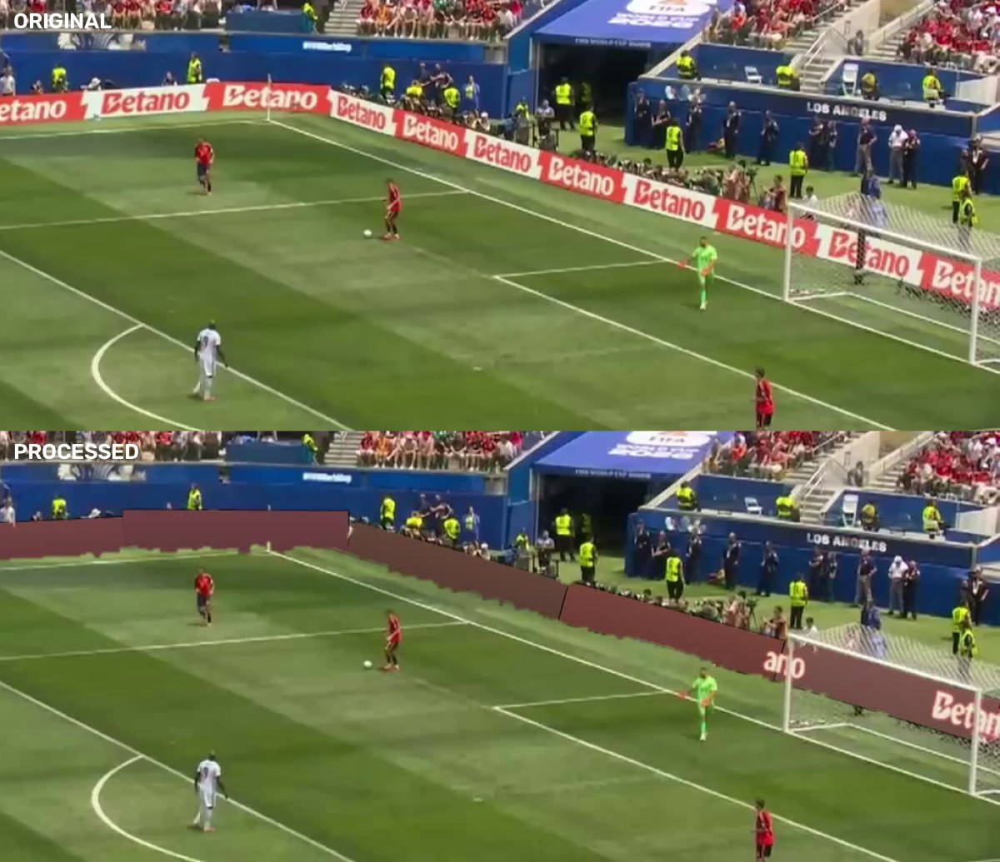

# Betting Ad Blocker

An offline computer-vision pipeline that finds betting/gambling advertising boards in football broadcast video and hides them with a flat, board-matched fill — without covering players, referees, the goal frame, or any non-betting sponsor on the same rail.


*Betano hidden on both perimeter rails. `kraken`, `kraken.com`, `MARRIOTT BONVOY`, `Be Active`, and `FIFA` on the same physical strip are left untouched — brand discrimination, not just "bright rectangle" detection.*

## What it does

1. **Detects** betting boards in broadcast video with a segmentation model trained specifically on this footage (not a generic ad-blocker — it distinguishes `Betano` / `Kalshi` / `PredictStreet` from co-located sponsors like Kraken, Marriott, Visa, FIFA, and scoreboard graphics).
2. **Fits** a clean quadrilateral per board from the segmentation mask — one rectangle per physical rail, not a stack of overlapping boxes.
3. **Tracks** boards across frames with a confirm-then-hold tracker (2-frame confirm, 3-frame hold) so panels never blink and never drift with camera motion — there is no optical-flow propagation to cause drift.
4. **Fills** each board with a colour sampled from the rail itself, so the result reads as a blank/unlit board rather than a black box.
5. **Protects** everything that must stay visible: players and referees (hard subtraction from an independent person model, restricted to people standing *in front of* the board — crowd and photographers behind it don't get carved out of the panel), the goal frame and net, the live scoreboard/clock overlay, and the pitch itself.

## Example: goal-area protection


*Near-side Betano rail hidden with a clean, board-matched rectangle; the goalpost and net stay fully visible. The far-side board behind the goal is a known limitation — see below.*

## Pipeline

```
input video
   │
   ▼
frame extraction (2 fps)
   │
   ▼
OCR sweep (whole-frame + tiled high-res pass)
   │
   ▼
brand classification  →  betting polygon labels + hard negatives
   │
   ▼
targeted synthetic data (repaint + close-up composites, weighted to weak brands)
   │
   ▼
train YOLO11-seg (fixture-disjoint train/val split — no frame leakage)
   │
   ▼
render: detect → merge/clean masks → fit rectangle per rail → track → fill → protect → composite
   │
   ▼
verify: OCR before/after, person-pixel overlap, sponsor preservation
```

Every stage is a standalone script under `scripts/`, orchestrated end-to-end by `scripts/v2_pipeline.py`, which is resumable — a crash, reboot, or manual stop picks back up from the last completed stage rather than restarting.

## Current results

Measured on the full 20-clip evaluation set (not a curated sample), by re-running OCR on the actual rendered output:

| Metric | Result |
|---|---|
| Betting ad text removed | **73.5%** |
| Non-betting sponsors preserved | **99.8%** |
| Player/referee pixels incorrectly painted | **0.81% max, ~0% on most clips** |

### Known limitations

This is stated plainly rather than glossed over:

- **Boards seen from a steep angle behind the goal** are detected less reliably than boards on the near touchline — the model under-predicts very long or heavily foreshortened rails.
- **`Kalshi`'s green-on-black wordmark** is the weakest brand class (fewer real training examples than `Betano`), and is still missed on a meaningful fraction of frames despite targeted synthetic oversampling.
- Both are training-data problems, not renderer bugs — the fill/tracking/protection logic behaves correctly whenever the board is detected at all. The straightforward next step is harvesting more real crops of exactly these two cases (extreme angle, low-contrast green) rather than further renderer tuning.

## Repository layout

```
scripts/          all pipeline stages: extraction, OCR, labelling, synthetic data,
                   training, rendering, verification
notebooks/         interactive workflow entry point
config.yaml         pipeline configuration
```

Large generated artifacts (`data/`, `models/`, `runs/`, `outputs/`, `logs/`, `input/`) are intentionally not committed — they are multi-GB of raw video, extracted frames, and trained weights that are reproducible by running the pipeline, not by cloning it.

## Key scripts

| Script | Purpose |
|---|---|
| `v2_pipeline.py` | End-to-end orchestrator with resume-from-last-stage and a run lock to prevent concurrent execution |
| `v2_ocr_survey.py` / `v2_ocr_tiles.py` | Whole-frame and tiled high-resolution OCR passes |
| `v2_brands.py` | Betting vs. non-betting brand classification from OCR text |
| `v2_annotate.py` | OCR text → betting-strip polygon labels, with hard-negative frames |
| `v2_synth.py` | Targeted synthetic training data (brand repaint + close-up composites) for measured weak spots |
| `v2_dataset.py` | Fixture-disjoint train/val split (no near-duplicate frame leakage) |
| `v2_train.py` | Trains the YOLO11-seg detector, resumable from `last.pt` |
| `v2_render.py` | The renderer: detection → clean rectangle fitting → tracking → fill → protection → composite |
| `v2_verify.py` | Measures the actual rendered output against the original (OCR + person-overlap), rather than trusting the renderer's own claims |

## Setup

```bash
pip install -r requirements.txt
```

Requires `ffmpeg` on `PATH` and a CUDA-capable GPU for training/inference.

## Usage

```bash
# Run the whole pipeline (resumable)
python scripts/v2_pipeline.py

# Check progress at any time
python scripts/v2_pipeline.py --status

# Render a single video with an existing model
python scripts/v2_render.py --input path/to/video.mp4 --output out.mp4
```

## Design notes

A few decisions that mattered enough to be worth stating:

- **No optical-flow panel propagation.** Early versions carried the panel across frames using camera-motion estimation, which caused visible drift during pans. The current renderer only ever paints where the detector currently sees a board, plus a short confirm/hold window — this trades a small amount of recall on brief detection dropouts for a panel that never drifts.
- **Person protection is directional.** Subtracting *every* detected person from the paint area punches notches out of the board wherever a crowd member or photographer stands behind the rail. Only people whose feet fall below the board's bottom edge — i.e. people standing on the pitch, in front of the board — are protected.
- **Verification re-derives the result from the output video**, not from the renderer's internal bookkeeping. The removed/kept percentages above come from running OCR on the actual rendered frames and diffing against the source, specifically to avoid the renderer's own success claims being taken on faith.
